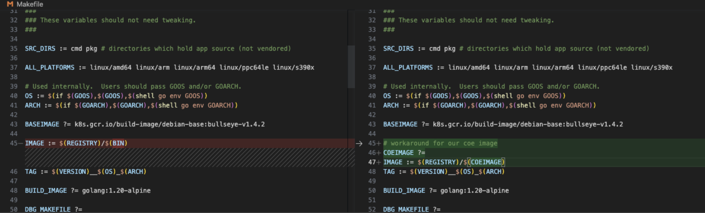

# Airflow for EKS - Git Sync Base

The Git Sync image, even its last version, has container vulnerabilities.

To use it, we decided to build it from it's repository.

The steps to do it was:

1. Download the repository <https://github.com/kubernetes/git-sync>

2. Change to the last stable version (tag 3.6.6)

    ```shell
    git checkout v3.6.6
    ```

3. Change the Makefile file in lines:

    

4. Login in AWS account where we will push the image (Operations DEV)

5. Login on ECR in the account

6. Create the image:

    ```shell
    make container \
      REGISTRY=837714169011.dkr.ecr.sa-east-1.amazonaws.com \
      COEIMAGE=airflow-git-sync \
      VERSION=v1.0.0 \
      GOOS=linux \
      GOARCH=amd64 \
      BASEIMAGE=837714169011.dkr.ecr.sa-east-1.amazonaws.com/linux-base-image:v12.0.0
    ```

7. Push image to ECR in the account:

    ```shell
    make push \
      REGISTRY=837714169011.dkr.ecr.sa-east-1.amazonaws.com \
      COEIMAGE=airflow-git-sync \
      VERSION=v1.0.0 \
      GOOS=linux \
      GOARCH=amd64 \
      BASEIMAGE=837714169011.dkr.ecr.sa-east-1.amazonaws.com/linux-base-image:v12.0.0
    ```