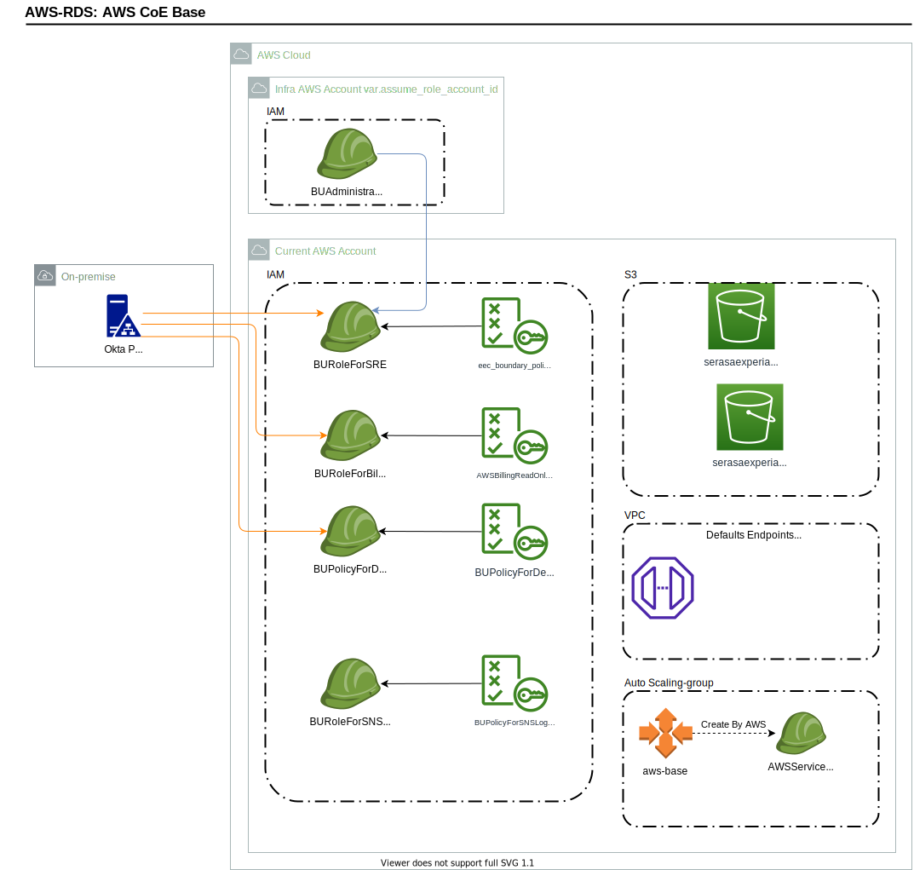

<!-- BEGIN_TF_DOCS -->
# AWS CoE Base

Install the default infrastructure on the AWS accounts

* ## Examples

[AWS Base](examples/aws-base)


## Environment

- sandbox
- dev
- uat
- prod

***NOTE***

For each environment that you create you should create two files
- First in the root path called variables-ENV.tfvars
- Second into the backend-config/ENV.tf

Take files already insides theses places as example to create your own

## Generate Documentation

```bash
make gen-doc
```

## Requirements

| Name | Version |
|------|---------|
| <a name="requirement_terraform"></a> [terraform](#requirement\_terraform) | >= 1.0.1 |
| <a name="requirement_aws"></a> [aws](#requirement\_aws) | = 4.22.0 |

## Providers

| Name | Version |
|------|---------|
| <a name="provider_aws"></a> [aws](#provider\_aws) | = 4.22.0 |
| <a name="provider_local"></a> [local](#provider\_local) | n/a |

## Modules

No modules.

## Resources

| Name | Type |
|------|------|
| [aws_autoscaling_group.aws-base](https://registry.terraform.io/providers/hashicorp/aws/4.22.0/docs/resources/autoscaling_group) | resource |
| [aws_iam_policy.BUPolicyForSNSLog](https://registry.terraform.io/providers/hashicorp/aws/4.22.0/docs/resources/iam_policy) | resource |
| [aws_iam_role.BURoleForBillingAccess](https://registry.terraform.io/providers/hashicorp/aws/4.22.0/docs/resources/iam_role) | resource |
| [aws_iam_role.BURoleForDevelopersAccess](https://registry.terraform.io/providers/hashicorp/aws/4.22.0/docs/resources/iam_role) | resource |
| [aws_iam_role.BURoleForSNSLog](https://registry.terraform.io/providers/hashicorp/aws/4.22.0/docs/resources/iam_role) | resource |
| [aws_iam_role.BURoleForSRE](https://registry.terraform.io/providers/hashicorp/aws/4.22.0/docs/resources/iam_role) | resource |
| [aws_iam_role_policy.BUPolicyForDevelopersAccessEMR](https://registry.terraform.io/providers/hashicorp/aws/4.22.0/docs/resources/iam_role_policy) | resource |
| [aws_iam_role_policy.BUPolicyForDevelopersAccessLambda](https://registry.terraform.io/providers/hashicorp/aws/4.22.0/docs/resources/iam_role_policy) | resource |
| [aws_iam_role_policy.BUPolicyForDevelopersAccessS3Airflow](https://registry.terraform.io/providers/hashicorp/aws/4.22.0/docs/resources/iam_role_policy) | resource |
| [aws_iam_role_policy.BUPolicyForDevelopersAccessS3EMR](https://registry.terraform.io/providers/hashicorp/aws/4.22.0/docs/resources/iam_role_policy) | resource |
| [aws_iam_role_policy.BUPolicyForDevelopersAccessS3Heimdall](https://registry.terraform.io/providers/hashicorp/aws/4.22.0/docs/resources/iam_role_policy) | resource |
| [aws_iam_role_policy.BUPolicyForDevelopersListS3](https://registry.terraform.io/providers/hashicorp/aws/4.22.0/docs/resources/iam_role_policy) | resource |
| [aws_iam_role_policy_attachment.BURoleForBillingAccess-attach](https://registry.terraform.io/providers/hashicorp/aws/4.22.0/docs/resources/iam_role_policy_attachment) | resource |
| [aws_iam_role_policy_attachment.BURoleForSNSLog-attach](https://registry.terraform.io/providers/hashicorp/aws/4.22.0/docs/resources/iam_role_policy_attachment) | resource |
| [aws_iam_role_policy_attachment.BURoleForSNSLog-attach2](https://registry.terraform.io/providers/hashicorp/aws/4.22.0/docs/resources/iam_role_policy_attachment) | resource |
| [aws_iam_role_policy_attachment.BURoleForSRE-attach](https://registry.terraform.io/providers/hashicorp/aws/4.22.0/docs/resources/iam_role_policy_attachment) | resource |
| [aws_kms_grant.grant_auto_scaling_group](https://registry.terraform.io/providers/hashicorp/aws/4.22.0/docs/resources/kms_grant) | resource |
| [aws_launch_template.aws-base](https://registry.terraform.io/providers/hashicorp/aws/4.22.0/docs/resources/launch_template) | resource |
| [aws_s3_bucket.logs_bucket](https://registry.terraform.io/providers/hashicorp/aws/4.22.0/docs/resources/s3_bucket) | resource |
| [aws_s3_bucket.tf_state](https://registry.terraform.io/providers/hashicorp/aws/4.22.0/docs/resources/s3_bucket) | resource |
| [aws_s3_bucket_acl.logs_bucket_bucket_acl](https://registry.terraform.io/providers/hashicorp/aws/4.22.0/docs/resources/s3_bucket_acl) | resource |
| [aws_s3_bucket_logging.tf_state_logging](https://registry.terraform.io/providers/hashicorp/aws/4.22.0/docs/resources/s3_bucket_logging) | resource |
| [aws_s3_bucket_policy.logs_bucket_policy](https://registry.terraform.io/providers/hashicorp/aws/4.22.0/docs/resources/s3_bucket_policy) | resource |
| [aws_s3_bucket_public_access_block.logs_bucket_access_block](https://registry.terraform.io/providers/hashicorp/aws/4.22.0/docs/resources/s3_bucket_public_access_block) | resource |
| [aws_s3_bucket_public_access_block.tf_state_access_block](https://registry.terraform.io/providers/hashicorp/aws/4.22.0/docs/resources/s3_bucket_public_access_block) | resource |
| [aws_s3_bucket_server_side_encryption_configuration.logs_bucket_encryption](https://registry.terraform.io/providers/hashicorp/aws/4.22.0/docs/resources/s3_bucket_server_side_encryption_configuration) | resource |
| [aws_s3_bucket_server_side_encryption_configuration.tf_state_encryption](https://registry.terraform.io/providers/hashicorp/aws/4.22.0/docs/resources/s3_bucket_server_side_encryption_configuration) | resource |
| [aws_s3_bucket_versioning.logs_bucket_versioning](https://registry.terraform.io/providers/hashicorp/aws/4.22.0/docs/resources/s3_bucket_versioning) | resource |
| [aws_s3_bucket_versioning.tf_state_versioning](https://registry.terraform.io/providers/hashicorp/aws/4.22.0/docs/resources/s3_bucket_versioning) | resource |
| [aws_security_group.endpoints](https://registry.terraform.io/providers/hashicorp/aws/4.22.0/docs/resources/security_group) | resource |
| [aws_vpc_endpoint.default_endpoints](https://registry.terraform.io/providers/hashicorp/aws/4.22.0/docs/resources/vpc_endpoint) | resource |
| [local_file.environment](https://registry.terraform.io/providers/hashicorp/local/latest/docs/resources/file) | resource |
| [aws_ami.eec_latest_ami](https://registry.terraform.io/providers/hashicorp/aws/4.22.0/docs/data-sources/ami) | data source |
| [aws_caller_identity.current](https://registry.terraform.io/providers/hashicorp/aws/4.22.0/docs/data-sources/caller_identity) | data source |
| [aws_iam_account_alias.current](https://registry.terraform.io/providers/hashicorp/aws/4.22.0/docs/data-sources/iam_account_alias) | data source |
| [aws_iam_policy.eec_boundary_policy](https://registry.terraform.io/providers/hashicorp/aws/4.22.0/docs/data-sources/iam_policy) | data source |
| [aws_subnets.internal_experian](https://registry.terraform.io/providers/hashicorp/aws/4.22.0/docs/data-sources/subnets) | data source |
| [aws_vpc.selected](https://registry.terraform.io/providers/hashicorp/aws/4.22.0/docs/data-sources/vpc) | data source |

## Inputs

| Name | Description | Type | Default | Required |
|------|-------------|------|---------|:--------:|
| <a name="input_application_name"></a> [application\_name](#input\_application\_name) | Name of the aplication | `string` | n/a | yes |
| <a name="input_assume_role_account_id"></a> [assume\_role\_account\_id](#input\_assume\_role\_account\_id) | AWS Account ID that will assume role BURoleForSRE in this account | `string` | `"218245340339"` | no |
| <a name="input_aws_endpoints_urls"></a> [aws\_endpoints\_urls](#input\_aws\_endpoints\_urls) | List of endpoints to be created in Aws account | `list(any)` | <pre>[<br>  "com.amazonaws.sa-east-1.ecr.api",<br>  "com.amazonaws.sa-east-1.ecr.dkr",<br>  "com.amazonaws.sa-east-1.ec2",<br>  "com.amazonaws.sa-east-1.logs"<br>]</pre> | no |
| <a name="input_aws_region"></a> [aws\_region](#input\_aws\_region) | AWS Region | `string` | `"sa-east-1"` | no |
| <a name="input_bu_name"></a> [bu\_name](#input\_bu\_name) | Name of the BU | `string` | n/a | yes |
| <a name="input_bucket_tf_state_end_name"></a> [bucket\_tf\_state\_end\_name](#input\_bucket\_tf\_state\_end\_name) | For compatibilities purpose we introduced this new one variable to define end name for tf-state bucket name | `string` | `"tf"` | no |
| <a name="input_documention"></a> [documention](#input\_documention) | Aditional documentation to be joined with the default create by this moduele | `string` | `""` | no |
| <a name="input_env"></a> [env](#input\_env) | Environment (SANDBOX\|DEV\|UAT\|PROD) | `string` | `"Dev"` | no |
| <a name="input_path_documentation_file"></a> [path\_documentation\_file](#input\_path\_documentation\_file) | Path to create doc file path\_documentation\_file/docs/ENV.md, if empty the doc do not will be created | `string` | `""` | no |
| <a name="input_project_name"></a> [project\_name](#input\_project\_name) | Name of your project | `string` | `"mlcoe"` | no |
| <a name="input_vpc_tag_for_select"></a> [vpc\_tag\_for\_select](#input\_vpc\_tag\_for\_select) | Tag for select the VPC | `map(string)` | <pre>{<br>  "AWS_Solutions": "LandingZoneStackSet"<br>}</pre> | no |

## Outputs

| Name | Description |
|------|-------------|
| <a name="output_BURoleForBillingAccess_arn"></a> [BURoleForBillingAccess\_arn](#output\_BURoleForBillingAccess\_arn) | ARN for BURoleForBillingAccess - Grant access to Finance BU Team |
| <a name="output_BURoleForDevelopersAccess_arn"></a> [BURoleForDevelopersAccess\_arn](#output\_BURoleForDevelopersAccess\_arn) | ARN for BURoleForDevelopersAccess |
| <a name="output_BURoleForSNSLog_arn"></a> [BURoleForSNSLog\_arn](#output\_BURoleForSNSLog\_arn) | ARN for BURoleForSNSLog - IAM role for successful and failed deliveries |
| <a name="output_BURoleForSRE_arn"></a> [BURoleForSRE\_arn](#output\_BURoleForSRE\_arn) | ARN for BURoleForSRE - Grant cross account access from infra account |
| <a name="output_aws_autoscaling_group_role_arn"></a> [aws\_autoscaling\_group\_role\_arn](#output\_aws\_autoscaling\_group\_role\_arn) | Auto Scaling Group ARN Role |
| <a name="output_key_name"></a> [key\_name](#output\_key\_name) | AWS Key pair name |
| <a name="output_s3_default_logs"></a> [s3\_default\_logs](#output\_s3\_default\_logs) | Name of S3 to store Logs |
| <a name="output_s3_tf_state"></a> [s3\_tf\_state](#output\_s3\_tf\_state) | Name of S3 to store TF state |
<!-- END_TF_DOCS -->