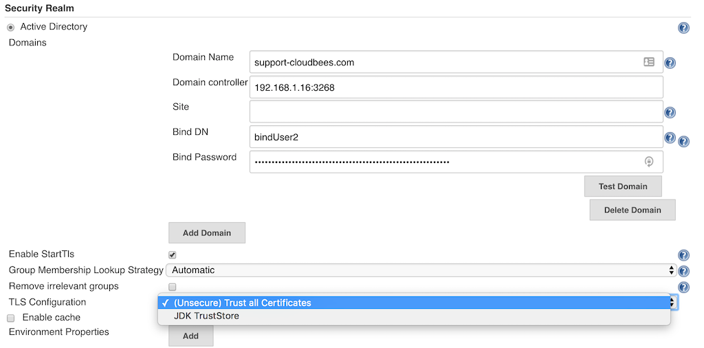

# PIAAS

PIAAS is a jenkins provisioning service with all tools certified by Experian.

# Features!

  - jenkins Provisioning ( by ansible )
  - Nginx reverse proxy Provisioning ( by ansible)
  - Tools ( awscli, docker, docker-compose, s3transfer, python, boto and etc ( it's customizable!!! )
  - Instance cloud ready! ( AWS)
  - terraform and ansible ready!!!
  - Redhat 8 Ready!!!
  
You can also:
  - Edit jenkins plugins provisioning in install  "ansible/group_vars/jenkins-app.yml"
  - Proxy Variables in "ansible/group_vars/proxy-env.yml"
  - add Roles with custom softwares in "ansible/group_vars/jenkins-app.yml"
 
# Structure
PIAAS Suports 2 ways instalation:
  - AWS-EC2 ( with Terraform and ansible)
  - Virtual Machines ( with ansible)
# Requeriments
  - Requires `curl`, `terraform`, `terraform-inventory` and `ansible` to be installed on the server. Also, newer versions of Jenkins require Java 8+ (see the test playbooks inside the `molecule/default` directory for an example of how to use newer versions of Java for your OS).
  - Terraform instalation Will need the application in this [repository](https://code.experian.local/scm/scib/binary-automation.git)
  - Proxy allow access to URL in [Proxylist Repository](https://code.experian.local/projects/SCIB/repos/proxy-whitelist/browse)
 ## Terraform Instalation
 Needs to edit 2 files with the account variables:
  - mainf.tf with s3 to save terraform tfstate.
  - vars.tf with AWS variables account
  - Teraform will we probisioning the ec2 instance to install jenkins, the script infra automatically feel the information of hosts to "ansible/hosts" with terraform-inventory. Another changes, can be do in "ansible/group_vars"

to call terraform/ansible
> #infra up

 ## Ansible Instalation
Ansible instlaation will need the aplication ansible in linux hosts, and also a user with sudo permission with no password ( with name ansible) and a key to connect to a instance/virtual Machine. ALL THE VARIABLES contain in "ansible/group_vars" folder.

- jenkins-app.yml, In this file contain variables to jenkins, jenkins-plugins, nginx reverse proxy and software to install in instance/VM.
- hostname-env.yml, Configuration of variables to define hostname

#### Ansible-playbook
- ansible playbook is located in "ansible/playbook.yml" if you need add any ansible role.
- hosts, the file "ansible/hosts" is the file contain the hosts to play the playbook.

to call ansible:
> #ansile-playbook -i ansible/hosts ansible/playbook.tml

## Ldap Integration
- The jenkins's Active Directory Plugin installed in automation
- The integration:
  - click in "manage Jenkins", Global Security, check the option "Active Directory" and click in "Add Domain"
  - Example in Image
  
  

