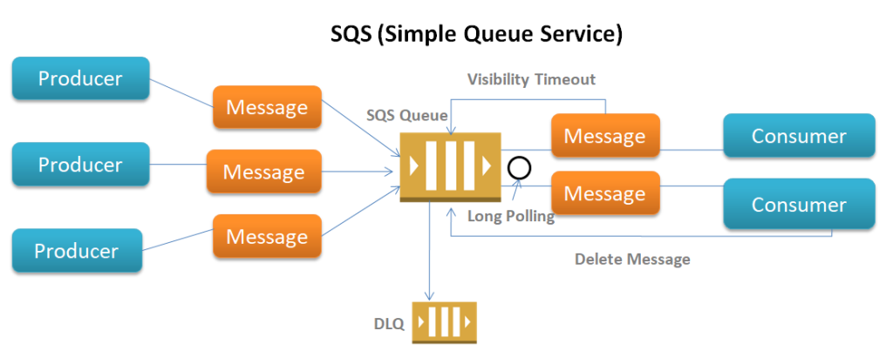

# AWS Service - SQS

----

Topology aws-service-sqs - Version 1.0.0

 

## O que é o aws-service-sqs?

Olá sou um launch para lançar uma fila [SQS na AWS](https://aws.amazon.com/pt/sqs/) dentro dos padrões de segurança da Serasa Experian.

| Caracteristica         | Descrição               |
| ---------------------- | ------------------------|
| Categoria              | AWS                     |
| ITIL Request           | False                   |
| ITIL Change Order      | False                   |
| Inner Source           | Times podem participar da evolução do mesmo                       |
| Conformidade           | O launch garante os padrões DevSecOps PaaS para criação de launch |
| Segurança              | Toda fila SQS é criada com *Encryption* ativado                   |

### Parâmetros

| Parameters     | Description          | Mandatory | Exemplo         | Regex                         |
| -------------- | -------------------- | --------- | --------------- | ----------------------------- |
| aws_account_id | AWS account ID       | yes       | 123456789023    | ` /^(\d{1,12}\|\d{1,12})$/g ` |
| country        | Choose you country   | yes       | BR              | -                             |
| region         | Choose AWS region    | yes       | EITS_Enterprise | -                             |
| bu             | Choose you BU        | yes       | EITS_Enterprise | -                             |
| app_name       | Inform the app name  | yes       | catalog         | ` /^[0-9a-z_-]{1,15}$/gm `    |
| queue_name     | Define a queue name  | yes       | my-queue-name   | ` /^[0-9a-z_-]{1,50}$/gm `    |
| message_retention     | Define the number of seconds Amazon SQS retains a message  | yes       | 345600   | ` ^[0-9]{3,7}$/gm `    |
| tfstate_save   | Want to save the tf state ? | yes | no             | - |
| tfstate_action | Want to apply or plan ? | yes | apply | - |

**ATENÇÃO:** O nome da fila segue o padrão `{{ app_name }}-{{ queue_name }}-{{ env }}-sqs-queue`

## Como lançar

- [General User Guide](https://code.experian.local/projects/SCIB/repos/joaquin-x/browse/doc/user_guide.md) - Escolha `aws-service-sqs`.

### Salvando o estado do Terraform

Na versão 1.0.0 adicionamos a opção de salvar o estado do Terraform ( parâmetro `tfstate_save`).

Para executar esse launch como todos os outros (sem se preocupar com o estado do Terraform), basta você fazer as seguintes opções:

- `tfstate_save` = `no`
- `tfstate_action` = `apply`

Agora, caso queira usar salvando o estado, você precisa ter em sua conta AWS um bucket com o seguinte nome: `{AWS_ACCOUNT_ID}-catalog-terraform-states`. Onde `{AWS_ACCOUNT_ID}` é o ID da sua conta AWS (informado no primeiro parâmetro). 

## Como contribuir

- [Contributing Guide](docs/CONTRIBUTING.md) - Inner Source.

## Versioning

Não deixe de saber e contribuir para as próximas versões do `aws-service-sqs` [Backlog](docs/BACKLOG.md)

`1.0.0` - Wed Apr 27 2022

- `ADD` - Recurso de salvar estado do Terraform
- `ADD` - Endpoint para checagem da conta AWS

`0.1.0` - Mon Jan 31 18:20:48 -03 2022

- `ADD` - Criação do repositório e sua estrutura inicial  
- `ADD` - Criação de fila padrão
- `ADD` - Configuração da criptografia

## Author

- **gleise.teixeira** - (gleise.teixeira@br.experian.com)
