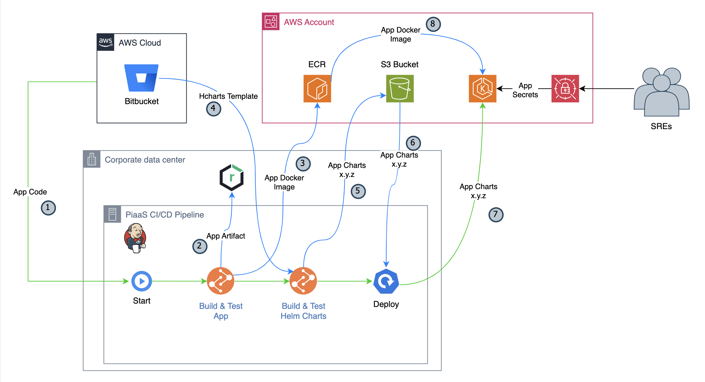
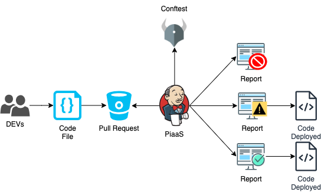

# Helm Charts Template - Stateless

This template creates the Helm Chart for a Stateless Application.

By using this template, you will be able to deploy your application in the EKS cluster created through the Service Catalog.

## Dependencies

To map the external access we use the [Istio Ingress Gateway](https://istio.io/latest/docs/tasks/traffic-management/ingress/ingress-control/), so you will need the [Istio](https://istio.io/) installed in your cluster where you pretend to install your application.

For the Canary Deploy we use [Flagger](https://flagger.app/), so you will need it installed in your cluster.

For validate Kubernetes Configurations we use [Kubeval](https://github.com/instrumenta/helm-kubeval) and [Conftest](https://github.com/instrumenta/helm-conftest)

All the required dependencies are provided by the [Service Catalog](https://cockpit-container-front-cockpit-container-br.f-internal.br.appcanvas.net/) EKS Automation.

## Version control

We will follow the [SemVer terminology](https://semver.org/spec/v2.0.0.html).

Each version of this template will be tagged, so you can use it in your application and be in control regarding the moment to upgrade for another version.

## How to set up your app

You will need to copy the file `hcharts-stateless/values.yaml` and add some configuration on the file `.jenkins.yml`.

Please, follow the instructions on [How to configure my application](docs/configuring-application.md)

## Local tests with demo-app

We have a demo application (demo-app) written in python that you can check as an example of how to use this template.

The bash scripts can be used to test locally the process of building and deploying.

First things first ... You have to set up your local environment. Check the instruction in [How to setting up your local environment](docs/setup-local-env.md)

Now use the `demo-app` to test the usage of this template by following the instructions in [How to run a local test](docs/local-test-demo.md)

## CI/CD Overview

## Conftest Flow

