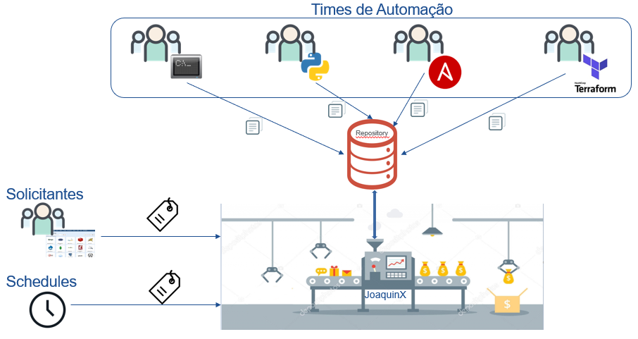

----

  <h1>** Joaquin X **</h1>

  

  <h3>Joaquin X - Browse Catalog Serasa Experian</h3>

  
  
  

 

## O que é o JoaquinX?

Olá eu sou o [JoaquinX](https://code.experian.local/projects/SCIB/repos/architecture/browse) o primeiro Browse Catalog da Serasa Experian e 100% Open Source, muito prazer :)

Imagine times de Infra, DevSecOps Guys, S.R.E., podendo desenvolver lançadores para criação de recursos ou solução de problemas como MongoDB, Kafka, EC2, VMWare, Regra de Firewall, para qualquer tecnologia e usando qualquer metodologia ou ferramenta de automação (terraform, ansible, etc)?
Tudo isso acontecendo com apenas alguns cliques a partir de um lançador e... _Voilá_! Os recursos necessários para seu projeto são criados e disponibilizados para uso.
Pode parecer mágica ou algo maluco não é mesmo!? Mas não é nada disso, deixa eu te explicar um pouco mais.

Fui projetado para ser um motor de execução de automações (trabalhos que um ser-humano executaria) poliglota capaz de agregar diversos tipos de automações parametrizadas e reutilizáveis por usuários da `Serasa Experian` sempre que necessário, ou seja, fui projetado para ser um Catálogo de Serviços.

Basicamente preciso de um arquivo que me conte o que devo perguntar ao usuário e como devo executar a automação, veja abaixo mais de minhas caracteristicas:

| Caracteristica                  | Descrição             
| --------------------------------| ------------------------
| GITOPS                          | Tudo está no bitbucket para executar as automações;
| Integrado ao ITIL Change Order  | Integrado com o service now iniciando um processo ITIL que roda paralelo a execução da automação;
| Integrado ao ITIL Request       | Integrado com o service now para leitura de RITM da request e execução da mesma com parse das informações;
| Formulários dinâmicos           | Um arquivo de configuração me conta o que devo perguntar ao usuário e com isso crio o formulário de forma dinâmica;
| Agnóstico a tecnologia          | O usuário não precisa conhecer o que está acontecendo, basta preencher as informações do fomulário para a automação ser executada;
| Inner Source                    | Times podem criar lançadores que outros times podem usar e com isso evoluimos juntos;
| Garanta a conformidade com padrões corporativos | O Service Catalog disponibiliza uma única localização na qual times podem gerenciar centralmente os catálogos de serviços de TI. Os times podem controlar quais serviços e versões de TI estão disponíveis, a configuração dos serviços disponíveis e o acesso de permissão por pessoa, grupo, departamento ou centro de custos ;

Agora é hora de escolher nos link abaixo por onde quer começar a usar, fique a vontade de enviar qualquer feedback para o time [DevSecOps Architecture Brazil](devsecops-architecture-brazil@br.experian.com).

## Como Começar
* [User Guide](https://code.experian.local/projects/SCIB/repos/joaquin-x/browse/doc/user_guide.md) - Guia de uso para usuários que desejam lançar recursos
* [User Guide Developer](https://code.experian.local/projects/SCIB/repos/joaquin-x/browse/doc/user_guide_developer.md) - Guia de uso para desenvolvedores de infra que desejam criar lançadores de recursos
* [Laçadores](https://code.experian.local/projects/SCIB/repos/joaquin-x/browse/doc/launchs.md) - Guia dos lançadores 
* [Normalizar Request](https://code.experian.local/projects/SCIB/repos/joaquin-x/browse/doc/normalizar_request.md) - Normalizar Request
* [Realizar Onboard Contas Aws](https://code.experian.local/projects/SCIB/repos/joaquin-x/browse/doc//onboard_aws_account.md) - Realizar Onboard Contas Aws

## Versioning

Não deixe de saber e contribuir para as próximas versões do JoaquinX [Backlog](BACKLOG.md) 

`2.10.1` - 
* `UPD` - Adicionado novo safe BR_PSCA na integração com o CyberArk.

`2.10.0` -  09 de Fevereiro de 2023
* `UPD` - NIKEDEVSEC-2988 - Garantir a rastreabibilidade dos launchers à diretoría;

`2.8.0` -  11 de Janeiro de 2023
* `UPD` - Alteração dos valores de custos por automação;

`2.5.0` -  08 de Outubro de 2021
* `FEATURE` - Suporte a passar o usuário como parâmetro da execução;

`2.4.0` -  16 de Agosto de 2021
* `FEATURE` - Suporte a slave windows;
* `FEATURE` - Suporte a slave linux;
* `BUG`     - Erro no link de e-mail para launch;

`2.3.0` -  20 de Julho de 2021
* `BUG`     - Display de vault em modo debug;
* `FEATURE` - Schedulação para os RPA;
* `BUG`     - Bloqueio de execuções de usuários comum diretamente pelo jenkins, forçando sempre o uso da interface do catalogo;
* `FEATURE` - Normalização dos logs;

`2.2.0` - 23 de Junho de 2021
* `UPDATE`  - Dashboard de erros/done/in/processados de execução.
* `FEATURE` - Oficialização do nome do projeto.
* `FEATURE` - UI do front.
* `FEATURE` - Desenho arquitetura.
* `FEATURE` - Forçar solicitações vindo do front principal.
* `FEATURE` - Desenho UI do front. 
* `FEATURE` - Botão no front "crie sua automação", para wizard de novas automações.

`2.1.0` - 18 de Março de 2021
* `FEATURE` - Integração com snow leitura e execuções automática a partir de request aprovadas, sem a necessidade do dono da mesma ter que realizar o launch. 
* `UPDATE`  - Ajustes do type do jenkins.yml para abertura de change dos SRE. 
* `UPDATE`  - Aumento de numero de works do servidor spobrcatalog, aumentado para 10. 
* `FEATURE` - Atributo onwer com o email do dono da automação para receber email em caso de falhas. 
* `FEATURE` - Criação da branch de homolog para realizar homologações diretamente por ela. 
* `UPDATE`  - Não fechar request em execuções de homologação. 
* `BUG`     - Uso de submodules nos launch com auto-update (https://stackoverflow.com/questions/5828324/update-git-submodule-to-latest-commit-on-origin). 
* `BUG`     - Limpar caracteres especiais vindos da request que podem deixar o json invalido. 

`2.0.0` - 18 de Janeiro de 2021
* `FEATURE` - Integração com snow para aplicar automações a partir de request.
* `FEATURE` - Integração com snow para encerramentos de request.
* `FEATURE` - Integração com o snow para abertura de change order.
* `UPDATE`  - Fluxo de automação.
* `UPDATE`  - Convenção do joaquin-infra.yml com enrriquecimento de paramentros ITIL.

`1.0.0` - 14 de Dezembro de 2020
* `ADD`- Versão inicial do serviço `Browse Catalog` na Serasa Experian.

## Author

* **DevSecOps PaaS** - (devsecops-architecture-brazil@br.experian.com)