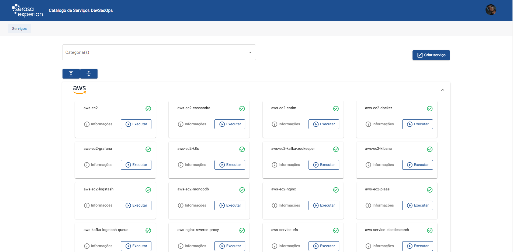
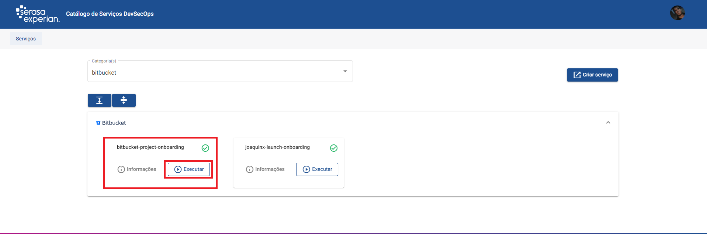
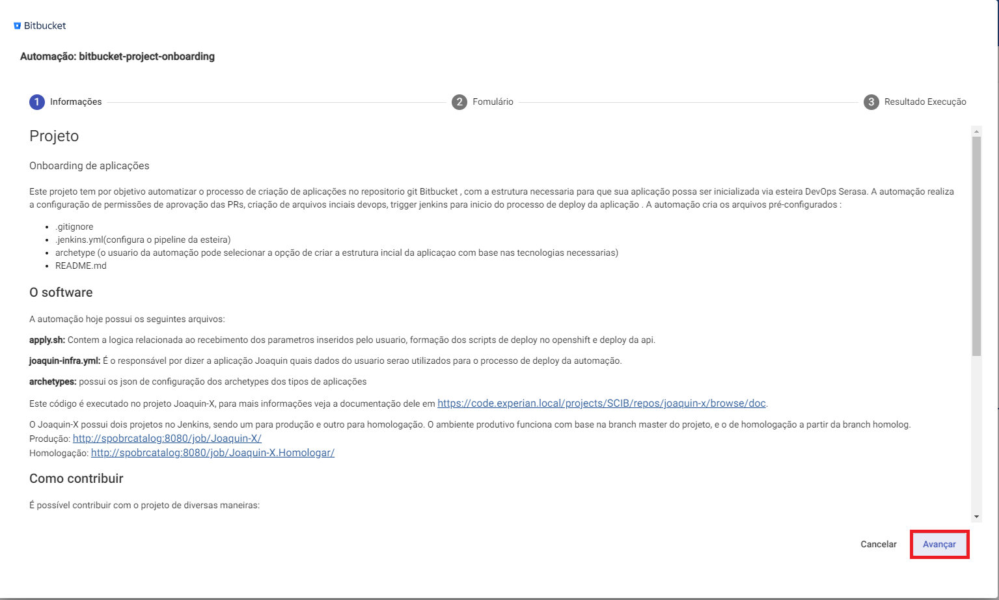
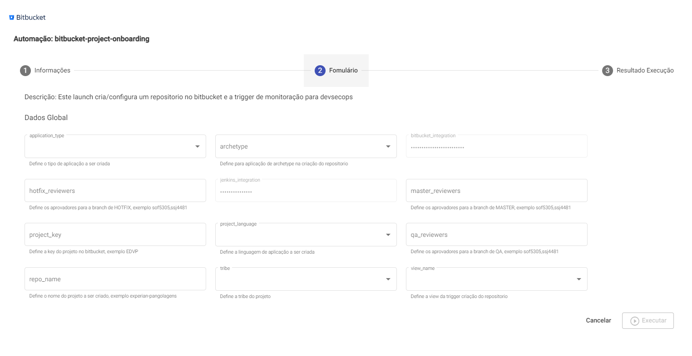
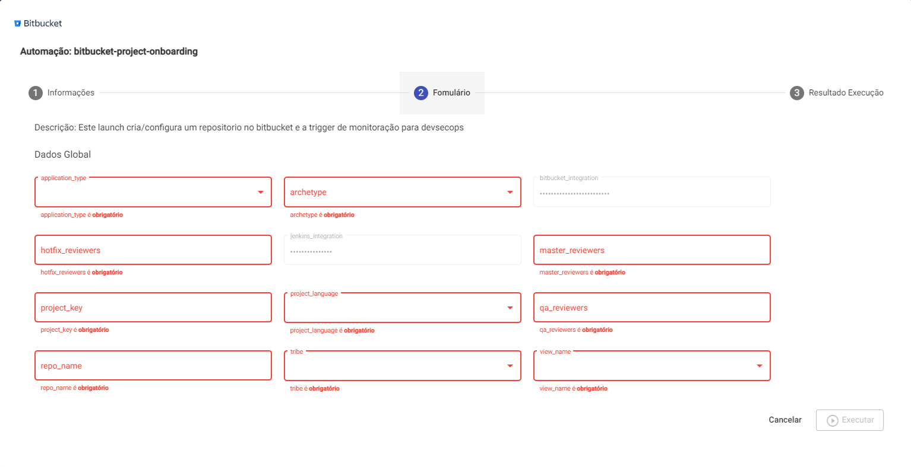
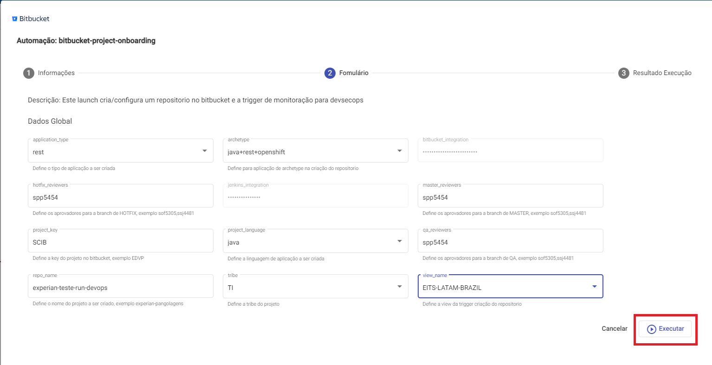
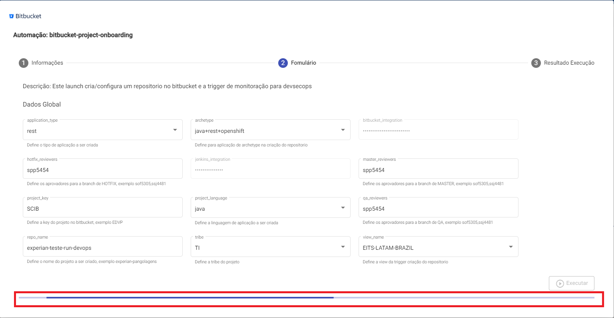
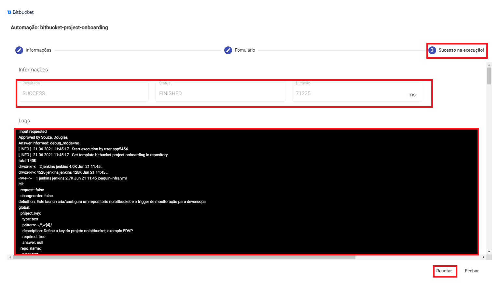

** Guia do Usuário **
----
> Browse Catalog Serasa Experian, Como usar :)

## Como Usar

São simplesmente `OITO` passos para o paraiso.
------

Iremos te guiar passo a passo de como usar o `JoaquinX - Browse Catalog Serasa Experian`, que basicamente é um wizard que irá te perguntar algumas informações da configuração do lançador e aplicar para você a automação e depois só ir para a casa feliz e encantado.

## Onboard de contas AWS

Para lançar recursos ou serviços em contas EEC da AWS, primeiramente é necessário fazer o onboard da sua conta na estrutura de automação do JoaquinX. Veja em [Onboard de contas AWS](onboard_aws_account.md) como proceder.

## Vamos lançar algo :)

1. Acesso
> Basta acessar a interface por este link [Acessar Agora](https://catalogo-infra-front-catalog-infra.f-internal.br.appcanvas.net/login), e informe seu `usuário/senha`. Validado o acesso você será redirecionado para a listagem das automações disponíveis.

2. Escolha o launch
> Selecione o `launch` desejado e clique em `EXECUTAR`! Nesse caso utilizaremos como exemplo o `bitbucket-project-onboarding` (Aquela automação que realiza o processo de onboarding de aplicações Serasa xD ).

3. Leia as informações
> Leia as informações do `launch` afim de validar se é realmente o `launch` que você deseja executar. Feito isso clique no botão `AVANÇAR`.

4. Preencha as informações para executar o launch
> Nessa etapa você precisa informar os dados necessários para a `EXECUTAR` o `launch`.

5. Campos obrigatórios
> Lembrando que para a liberação do botão `EXECUTAR` é necessário o preenchimento de todos os campos obrigatórios.

6. Hora de lançar
> Preenchido todos os campos obrigatórios clique no botão `EXECUTAR`.

7. Hora de lançar
> Agora basta aguardar a execução de seu `launch`, isso não é demais?

8. Pronto processo finalizado
> Pronto processo finalizado ! Fique atento as informações do resultado da execução afim de validar se a automação finalizou com sucesso. Caso queira fazer uma nova execução basta clicar no botão resetar para limpar os dados do formulário ou se quiser reexecutar alterando somente alguns campos e mantendo os que já foram inseridos anteriormente retorno ao passo `QUATRO` porem lembre-se sempre de validar as informações dos campos preenchidos.

### Parabéns o Greenpeace agradeçe pois você acaba de salvar 1 baleia no mundo e nos ficamos muito felizes pois uma automação te deixou feliz!!!

## Author

* **DevSecOps PaaS** - (devsecops-architecture-brazil@br.experian.com)
