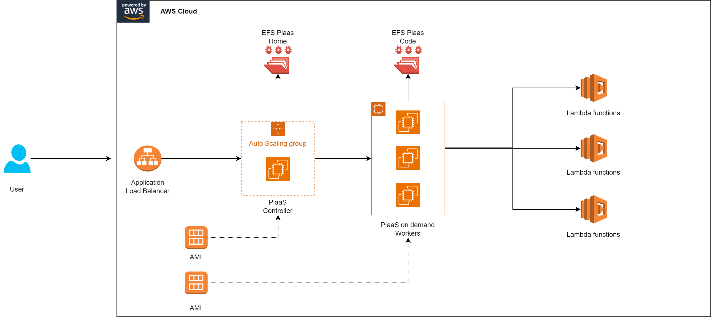

# Contribua

###### PiaaS Design

Muita coisa mudou da nossa antiga esteira corporativa para o PiaaS, demos passos muito além de uma migração para a Cloud: inovamos e criamos uma nova arquitetura visando facilitar a sua <b>escalabilidade</b>, <b>disponibilidade</b>, <b>manutenção</b> e claro a <b>contribuição</b>.

### Infraestrutura como código

Nós desenvolvemos automações que criam a nossa infraestrutura como código: EFS, EC2, ALB, ASG e AMI.

Partimos agora para um conceito de efemeridade quando falamos de servidores, ou seja, a máquina onde nossa estrutura roda é irrelevante, o que importa é todo nosso fluxo de provisionamento dessas máquinas!

Por isso, nós geramos AMIs com algumas das nossas automações que são responsáveis por provisionar posteriormente, via automação, um novo servidor com as atualizações que foram realizadas.

E o mais legal: nossos workers (responsáveis por executar os processos de CI/CD) são provisionados <b>automaticamente</b> e <b>sob demanda</b>!

* As execuções ocuparam todos os servidores? Sem problemas: um novo servidor será provisionado automaticamente e as execuções poderão seguir sem muita demora.
* Um worker ficou por muito tempo ocioso, sem uso? Sem problemas também: a máquina será desligada e deletada automaticamente após um tempo.

Dessa forma conseguimos garantir maior disponibilidade e velocidade na jornada de desenvolviemnto dos utilizadores da esteira.

Você pode clicar [aqui](infra_contribute.md) para entender mais sobre como colaborar com nossa infraestrutura.

### Um novo CORE

O código do PiaaS foi completamente refatorado, criando uma divisão mais lógica entre os arquivos visando facilitar a manutenção e o entendimento sobre o código como um todo.

Além disso, retiramos códigos desnecessários para a nossa nova realidade, containerizamos mais operações, criamos Lambdas para algumas tarefas e muito mais! Facilitando a jornada dos desenvolvedores que utilizarem o PiaaS.

Você pode clicar [aqui](core_contribute.md) para entender mais sobre como colaborar com nosso CORE.