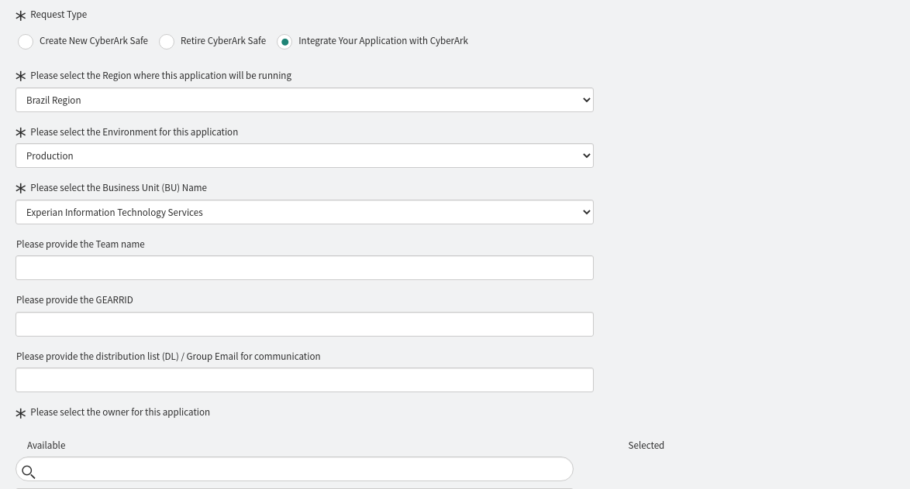
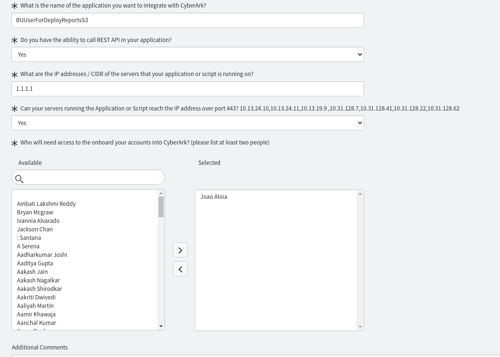

## CyberArk Onboarding

O onboarding do CyberArk permite que seus cofres estejam habilitados a serem resgatados pelo PiaaS.

Desta forma, suas senhas podem ser utilizadas através do Pipeline de forma segura e com total liberdade na gestão dos segredos, visto que eles permanecem em poder do time.

## Solicitando

Você deve abrir uma solicitação no [SNOW](https://experian.service-now.com/now/nav/ui/classic/params/target/com.glideapp.servicecatalog_cat_item_view.do%3Fv%3D1%26sysparm_id%3D41629973db3b4c988f814d7605961911%26sysparm_link_parent%3D5c96621fdb8383007bd1317ffe96199a%26sysparm_catalog%3De0d08b13c3330100c8b837659bba8fb4%26sysparm_catalog_view%3Dcatalog_default%26sysparm_view%3Dtext_search), ao time de PAM, para permitir que a esteira seja capaz de resgatar seus segredos.

Preencha o formulário conforme a seguir:

Em <i><b>Additional Comments</b></i>, adicione o texto a seguir, substituindo o local correspondente pelo nome do seu safe:

`Please configure the access of the Jenkins BR pipeline "host/eits-dsecops-jnkspipe-prd-br" to the safe "<YOUR_SAFE_NAME>" to retrieve the secret at the time of CI/CD deployments.`

Após o atendimento realizado pelo time de PAM, seu cofre já pode ser utilizado nas execuções do PiaaS.

* [Resgatando credenciais AWS do CyberArk](cyberark_retrieve_aws.md)
* [Resgatando credenciais estáticas do CyberArk](cyberark_retrieve_static.md)

## Dicas

* Em <i><b>Please select the owner for this application</b></i> e <i><b>Who will need access to the onboard</b></i> informe o SRE ou DevOps responsável pelo cofre.
* Em <b><i>What is the name of the application...</b></i> preencha com "All CyberArk Accounts related with my safe." 
