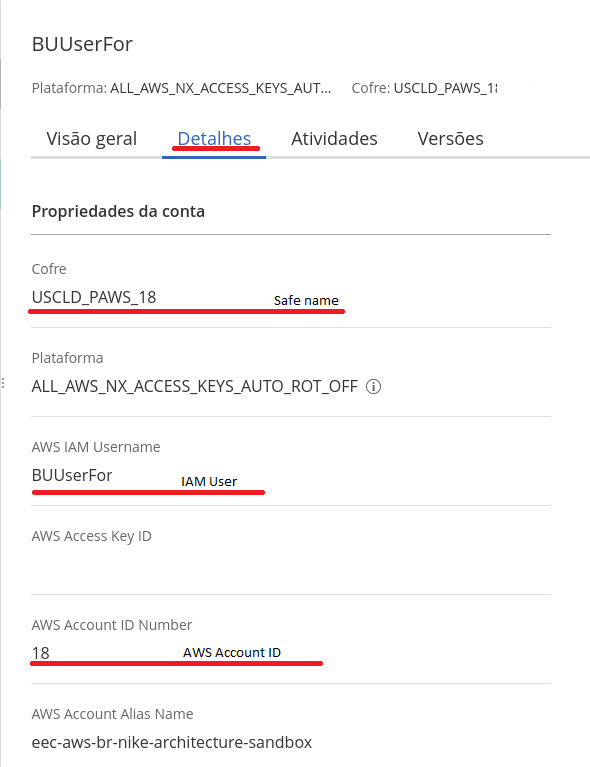

## Resgate de credenciais AWS do CyberArk

> **_NOTA:_**  Antes de realizar esse procedimento efetue o processo de [onboarding](cyberark_onboarding.md).

## Coletando as informações necessárias

Para seguir, você deve ter em mãos algumas informações do seu safe: o nome dele, a conta AWS e o usuário IAM. Você pode encontrar essas informações na console do CyberArk, na aba "Details".



## AWS CLI Deploys

Observe o exemplo abaixo:

```console
deploy:
    airflow:
    script: script: echo "Realizando copia de artefatos de Dags Cloud para AWS" &&
      credentials=$(cyberArkDap -s SAFE_NAME -c IAM_USERNAME -a AWS_ACCOUNT_ID) &&
      awsAccessKey=$(echo $credentials | cut -d' ' -f2) &&
      awsSecretKey=$(echo $credentials | cut -d' ' -f3) &&
      export AWS_ACCESS_KEY_ID=$awsAccessKey &&
      export AWS_SECRET_ACCESS_KEY=$awsSecretKey &&
      export AWS_DEFAULT_REGION=<AWS_REGIONS> &&
      export http_proxy=http://spobrproxy.serasa.intranet:3128 &&
      export https_proxy=http://spobrproxy.serasa.intranet:3128 &&
      /var/lib/jenkins/.local/bin/aws s3 sync WORKSPACE/deploy_aws/dags s3://bucket-dags-datahub-dev/dags/
```

## AWS EKS Deploys

Observe o exemplo abaixo:

```console
after_build:
  helm: --url-charts-repo=s3://se-60ed6375b21d019a-nike-eks-01-sandbox-helm-charts/onboarding-angular-api --safe=<CYBERARK_SAFE_NAME> --iamUser=<IAM_USER> --awsAccount=<AWS_ACCOUNT_ID> --aws-region=sa-east-1
  ...
deploy:
  eks:  --cluster-name=devsecops-eks-01-uat --project=catalog-uat --safe=<CYBERARK_SAFE_NAME> --iamUser=<IAM_USER> --awsAccount=<AWS_ACCOUNT_ID> --aws-region=sa-east-1
```

## AWS Lambda Deploys

Observe o exemplo abaixo:

```console
deploy:
  aws:  --method=lambda --safe=<CYBERARK_SAFE_NAME> --iamUser=<IAM_USER> --awsAccount=<AWS_ACCOUNT_ID>
```

## Testes Cucumber (com autenticação na AWS)

Observe o exemplo abaixo:

```console
...
vaultVariables=$(cyberArkDap -s SAFE_NAME -c IAM_USERNAME -a AWS_ACCOUNT_ID)
AWS_ACCESS_KEY=$(echo $credentials | cut -d' ' -f2)
AWS_SECRET_KEY=$(echo $credentials | cut -d' ' -f3)
...
```