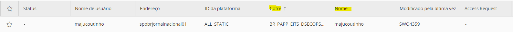

## Resgate de credenciais estáticas do CyberArk

> **_NOTA:_**  Antes de realizar esse procedimento efetue o processo de [onboarding](cyberark_onboarding.md).

## Coletando as informações necessárias

Para seguir, você deve ter em mãos algumas informações do seu safe: o nome dele e o nome da conta. Você pode encontrar essas informações na console do CyberArk.



## Exemplo de uso

No exemplo abaixo, o usuário resgata as informações de seu cofre e executa um script shell, que recebe as credenciais, para utilizar em seu processo de deploy.

```console
deploy:
    cyberArkCredentials=$(cyberArkDap --safe <YOUR CYBERARK SAFE NAME> -c "<YOUR CYBERARK ACCOUNT NAME>") &&
    cyberArkUser=$(echo $cyberArkCredentials| cut -d' ' -f1) &&
    cyberArkSecret=$(echo $cyberArkCredentials| cut -d' ' -f2) &&
    ./deploy.sh cyberArkUser cyberArkSecret
```