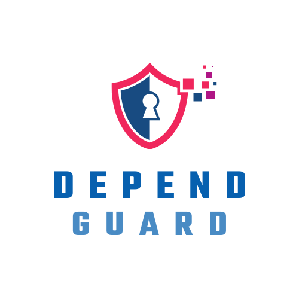

# DependGuard Bot

DependGuard Bot - Overview - Version 1.0.0 o/

 

# DependGuard

O DependGuard é uma ferramenta de automação de gerenciamento de dependências para projetos de software. Ele verifica regularmente as dependências de um projeto, identifica atualizações disponíveis e automaticamente cria pull requests para atualizar essas dependências. Isso ajuda a manter o software atualizado com as versões mais recentes de bibliotecas e componentes, melhorando a segurança e a estabilidade do projeto, além de facilitar o processo de atualização dessas dependências.

## Pontos Positivos do DependGuard

### 1. Identificação de Vulnerabilidades
DependGuard realiza análises de segurança em dependências de software, detectando vulnerabilidades conhecidas. Isso ajuda as equipes de desenvolvimento a mitigar riscos de segurança proativamente.

### 2. Automação de Atualizações
A ferramenta pode sugerir ou até automatizar a atualização de dependências para versões mais seguras e estáveis. Isso reduz o tempo e o esforço necessário para manter o software atualizado.

### 3. Redução de Débito Técnico
Mantendo as dependências atualizadas, o DependGuard ajuda a reduzir o débito técnico, evitando problemas de compatibilidade e falhas que podem surgir devido ao uso de bibliotecas desatualizadas.

### 4. Facilidade de Integração
DependGuard pode ser facilmente integrado a pipelines de CI/CD, garantindo que as verificações de dependências sejam parte do fluxo de desenvolvimento. 
Temos 2 modelos para o uso do <b><i>dependguard</i></b>:
- DependGuard CI/CD
    A automação DependGuard CI/CD é executada durante a execução do seu pipeline CI/CD, proporcionando verificações de dependências pontuais e imediatas durante o processo de integração contínua. Isso garante que cada build seja validado contra as dependências mais recentes e seguras. Nesse modelo, você pode apontar exatamente a branch que deseja que seja executado o escaneamento

- DependGuard RPA
    A automação DependGuard RPA alimenta o lake de dados de DevSecOps como "dependguard = true", onde o escaneamento de dependencias acontece periodicamente por meio de um RPA. Essa abordagem permite um escaneamento regular e sistemico dos repositórios, garantindo que todas as dependências estejam sempre atualizadas e seguras. Isso assegura a saúde do seu repositório, automatizando o processo de atualizações mesmo antes de ser executado o seu pipeline

### 5. Apoio à Conformidade
Ao garantir que as dependências sejam mantidas seguras e atualizadas, o DependGuard pode ajudar as organizações a cumprir requisitos de conformidade e regulamentações de segurança.

### 6. Relatórios e Visibilidade
A ferramenta fornece relatórios detalhados sobre o estado das dependências, oferecendo uma visão clara sobre o que precisa ser atualizado e o impacto potencial das atualizações.

Esses pontos tornam o DependGuard uma ferramenta valiosa para equipes de desenvolvimento que buscam melhorar a segurança, estabilidade e eficiência de seus projetos.

Para mais informações de como utilizar, consulte a [documentação completa](pipelines.md) e busque por `dependguard`.