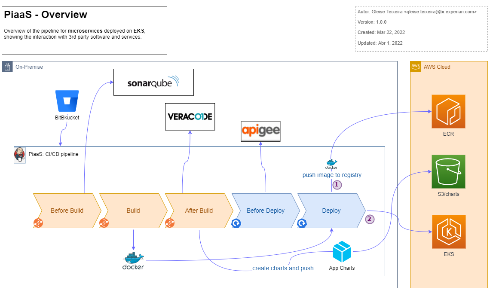

# Pipeline para EKS

Pipeline EKS - Overview - Version 1.0.0 o/

 

Nessa primeira versão o PiaaS cuida de todo o fluxo CI/CD da aplicação, fazendo o deploy por `push`, utilizando o comando `helm`.

Na fase `after build` temos o módulo `helm` responsável por gerar o pacote *Helm Charts* da aplicação e registrá-lo em um bucket S3 na conta AWS onde roda o EKS.

Na fase `deploy` temos o módulo `eks` que, assim como acontece com o processo do Openshift, ocorre as seguintes ações:

1. A imagem docker da aplicação é registrada no ECR presente na conta AWS onde roda o EKS;
2. O helm charts gerado na fase `after build` é aplicado no EKS da conta indicada;

Nessa primeira estratégia além de ter o EKS já implantado, é preciso preparar o ambiente (conta AWS) com as seguintes configurações:

- O repositório ECR precisa estar criado com o mesmo nome da aplicação;
- Usuário IAM com as permissões necessárias e onboarding do safe no [CyberArk](https://pages.experian.local/display/SRECTB/Pre-reqs#expand-PiaaSAccountOnboarding)

## Como acontece o Deploy

Olhando o estágio de `deploy` com mais detalhes temos o seguinte:

A explicação dos pontos destacados pelos números segue abaixo:

1. Toda ação de registro ou leitura de objetos na conta AWS vai depender de um Vault configurado no Servidor Jenkins que rodará a pipeline;
2. A imagem docker da app gerada durante o stage `build` é taggeada e enviada para o ECR;
3. O `charts` registrado durante o stage `after_build` é referenciado;
4. O `charts` é aplicado no EKS;

## Documentações

- Documentação sobre o [EKS Brazil](https://pages.experian.local/display/SRECTB/EKS+-+Brazil)
- [Pré Requisitos](https://pages.experian.local/display/SRECTB/Pre-reqs) para lançar o EKS em sua conta AWS e poder utilizá-la na rede Serasa Experian
- [Onboarding de conta AWS](https://pages.experian.com/display/EDPB/Onboarding+de+conta+AWS) - para poder usar o `Service Catalog` em sua conta AWS
- [Launch EKS using Service Catalog](https://pages.experian.local/pages/viewpage.action?pageId=1081223534)
- [Instruções detalhadas](pipelines.md) de como configurar sua aplicação para usar o PiaaS
