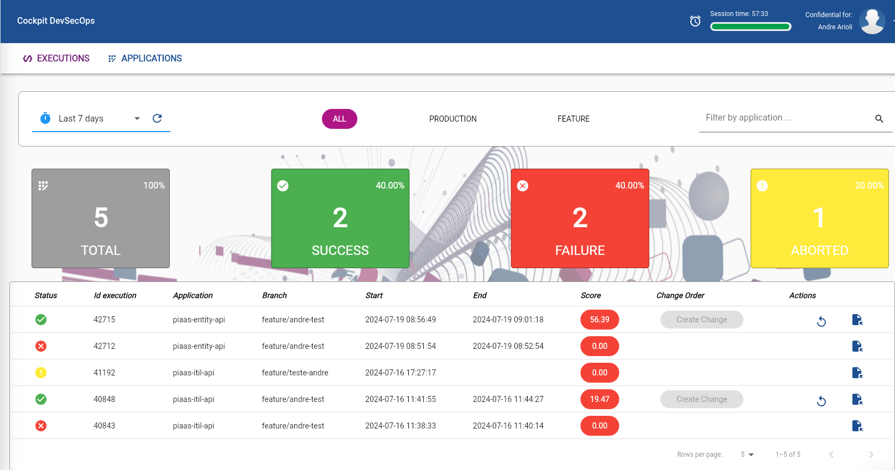
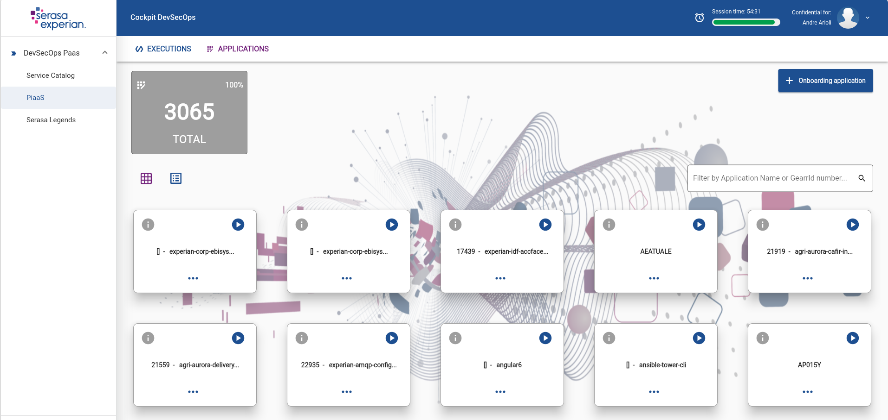

# PiaaS - Mudanças relevantes

Se você está lendo essa documentação significa que chegou a sua hora de migrar para o novo PiaaS!

Estamos ansiosos para que vocês possam experimentar essa nova experiência de Pipeline construída <b>100% por nosso time no Brasil</b> desde o último FY, corrigindo erros passados, melhorando nossos acertos e criando uma experiência incrível para sua jornada de desenvolvimento.

Como pontos importantes gostaríamos de citar:

* Front-end amigável para execução dos pipelines, criando uma experiência unificada para análise da sua execução;
* Nova base de dados com melhorias na modelagem de nossos dados;
* Change Order agora são criadas diretamente no Front-end, melhorando a jornada ITIL;
* Aprimoramos o processo do Veracode: agora são executados com paralelismo, utilizando Lambdas, acelerando o processo de início dos scan;
* O Score agora é calculado fora do Pipeline, em tempo real, por nossos APIs;
* Migração de todo o workload para a AWS;
* Criação de estrutura para disponibilidade e escalabilidade;
* Workers sob-demanda para execução de mais pipelines em paralelo;
* Criação do Nexus 3 para substituir o Nexus 2, utilizando HTTPS;
* Sonarqube alterado para HTTPS (mesmo servidor);
* Refatoração de todo o framework do PiaaS;
* Infraestrutura baseada 100% em IAC;
* Funcionalidade para gestão automática de dependências;
* Validação do Dockerfile para sugerir melhorias de forma automatizada.

E muito mais!

Entendemos seus anseios e dúvidas sobre como se planejar para essa mudança, por isso, vamos citar aqui pontos relevantes para te auxiliar nessa jornada para o novo PiaaS!

### Adeus, jenkins.yml

O nosso querido arquivo de orquestração de pipelines dá adeus e agora teremos um novo chamado de <i><b>piaas.yml</b></i>. Mas não estamos falando de uma simples mudança de nome de arquivos, também ocorreram mudanças na sua estruturação que você pode observar [aqui](pipelines.md) em um exemplo que montamos.

Após entendida a nova estrutura você pode seguir com as adequações. Lembrando: o arquivo piaas.yml e .jenkins.yml podem coexistir sem nenhum impacto, então essa é uma alteração que pode ser feita com bastante antecedência.

Para auxiliar um pouco mais nesse processo disponibilizamos uma automação no CockPit DevSecOps chamada <i>piaas-migrate</i>, na categoria <b>PiaaS</b>. A automação criará uma nova branch feature com a inclusão do piaas.yml em seu repositório, baseado nas informações existentes em seu antigo .jenkins.yml.

### Uma nova experiência de Pipeline

Criamos uma nova experiência de uso do PiaaS, agora com um Front-End exclusivo para realizar sua execuções, criar suas Change Order, verificar o histórico das suas execuções, conferir o Score, detalhes de scan do Veracode, Sonarqube e muito mais!

Também melhoramos a visualização dos logs das execuções para melhorar a jornada dentro do PiaaS.

Além disso, você também pode visualizar TODAS as suas aplicações através do <b>Applications</b> no menu do PiaaS. Por lá, mostraremos todas as aplicações que foram criadas informando o assignment_group (grupo ITIL) dos quais você faça parte, assim facilitando seu processo de execução.

Daqui em diante essa será sua nova casa para realizar as execuções da suas pipelines.

Caso você ainda não tenha acesso ao CockPit DevSecOps e ao PiaaS, você pode solicitar os grupos abaixo no IDC:

* APP-COCKPIT-DEVSECOPS_USER (Okta Production)
* APP-COCKPIT-DEVSECOPS_PIAAS_USER  (Okta Production)

Assim que aprovados e aplicados ele ficará disponível diretamente em seu Okta.

Vale destacar que você só terá acesso definitivo de execução no novo PiaaS quando o rollout para suas aplicações chegar: o processo será feito em ondas para diminuir os impactos nos times.

### Visualização do seu Score

Nós realizamos mudanças na forma que o Score é visualizado. Agora, não haverá mais a visualização e o cálculo dele diretamente na Pipeline, por isso, você não verá mais o seu Score calculado durante a execução, embora você ainda possa verificar o Score conquistado em cada pilar normalmente.

Vai funcionar assim:

* O Score gerado por cada pilar, em tempo de execução, será enviado para nossa API;
* O valor recebido será inserido no pilar correto, e será feito um recalculo para gerar seu Score dessa execução.

Ou seja, seu Score será alterado na visualização do Front-End conforme os Scores sejam gerados. Para a maioria deles você já terá o calculo disponível após o final da execução.

Mas se lembra do [Veracode](veracode.md)? Ele é um processo que demora até ser finalizado e antigamente era preciso executar novamente, após o relatório estar pronto, somente para ter o Score para esse pilar.

Com nosso novo processo você deve apenas aguardar a conclusão do scan do Veracode e automaticamente ele será inserido na sua execução e o score recalculado. Legal, né?

Ao clicar no seu Score da execução você será levado para uma página semelhante a essa:

No topo está Score calculado dessa execução até aquele momento, e logo abaixo você pode visualizar todos os Scores que você recebeu em cada pilar, bem como detalhes sobre elas (quando disponível).

Além disso, criamos um [novo Dashboard](#) onde você pode acompanhar todas as execuções realizadas no Pipeline.

### Criando sua OM

Nossos controles não mudaram: você ainda precisa de um Score > 80 para criar sua OM e todas as demais regras já conhecidas.

No entanto, transferimos a criação de OM da execução do pipeline para nosso Front-End. Como nosso Score agora é calculado em tempo real, podemos disponibilizar essa nova experiência.

Realizou sua execução, precisa validar antes de criar a OM? Antigamente, você teria que executar novamente sua execução somente para gerar a OM.
Agora ela pode ser criada a qualquer momento, desde que as políticas estejam todas atendidas.

Com a OM criada você pode seguir normalmente para sua execução em produção.

### Nexus 3 e SonarQube

Agora nosso [novo Nexus](https://nexus.devsecops-paas-prd.br.experian.eeca/#browse/welcome) e [SonarQube](https://sonarqube.devsecops-paas-prd.br.experian.eeca/) possuem HTTPS através do acesso por nossas novas URLs.

Mas atenção: o [antigo Nexus](http://spobrnxs01-pi:8081/nexus/#welcome) ainda continua online, mas o novo Nexus foi disponibilizado para que daqui em diante no PiaaS ele seja utilizado para operações envolvendo os artefatos.

Para garantir a compatibilidade, o [novo Nexus](https://nexus.devsecops-paas-prd.br.experian.eeca/#browse/welcome) consegue resgatar normalmente todos os artefatos do antigo Nexus então não se preocupe!

Nosso intuito é fazer uma migração <i>soft</i>, ou seja, com o tempo os novos artefatos internos lançados serão utilizados e os que estão no antigo terão seu uso fortemente diminuído.
Além disso, como o [novo Nexus](https://nexus.devsecops-paas-prd.br.experian.eeca/#browse/welcome) possuí acesso aos artefatos antigos, conseguiremos dados suficientes para entender os artefatos que de fato necessitem serem migrados.
Com isso, em momento oportuno, faremos as migrações de artefatos remanescentes que ainda estejam sendo utilizados no antigo Nexus para o [novo Nexus](https://nexus.devsecops-paas-prd.br.experian.eeca/#browse/welcome) e encaminharemos a desativação do antigo servidor.

Dessa forma evitamos:

* Correria nos times para migrações pesadas;
* De levar "lixo" para o novo Nexus;
* Retrocompatibilidade.

Quanto a esse assunto, não se preocupe, ele levará um tempo e avisaremos com bastante antecedência! O que você precisa saber é que em nosso novo PiaaS o uso do antigo Nexus não será mais aceito. Você pode conferir mais detalhes [aqui](pipelines.md).

Quanto ao SonarQube o servidor é o mesmo :) apenas adicionamos uma camada de HTTPS.

### DependGuard bot

DependGuard é uma ferramenta poderosa projetada para escanear e gerenciar dependências em seus projetos. Com sua capacidade de identificar e atualizar automaticamente dependências criando Pull Requests, ele ajuda a reduzir o tempo de desenvolvimento e a manter seu código seguro e atualizado com as ultimas versoes de dependencias.

Pontos Positivos do DependGuard
* Automatização de Atualizações: Identifica e atualiza automaticamente as dependências de seus projetos com Pull Requests automaticas.
* Redução de Tempo: Diminui significativamente o tempo necessário para gerenciar dependências.
* Segurança: Ajuda a manter suas dependências seguras, evitando vulnerabilidades conhecidas(SCA).
* Integração: Fácil integração com seu pipeline.

<b>Modos de uso:</b>

- DependGuard CI/CD: A automação DependGuard CI/CD é executada durante o pipeline CI/CD, verificando dependências de forma imediata e garantindo que cada build utilize as dependências mais recentes e seguras.

- DependGuard RPA: A automação DependGuard RPA alimenta o lake de dados de DevSecOps, onde um escaneamento periódico é realizado por um RPA. Isso garante que todas as dependências sejam regularmente atualizadas e seguras.

Para mais detalhes sobre o uso do DependGuard, consulte a [documentação completa](dependguard.md).

### Muito mais!

Temos muito mais novidades e melhorias que estão "escondidas" e que você sentirá conforme o uso. Mas as que citamos acima achamos pontos <b>ESSENCIAIS</b> que você saiba ao utilizar nosso PiaaS daqui em diante.

Você pode conferir todas nossas documentações para conhecer mais sobre as mudanças.

Se tiver qualquer dúvida ou quiser nos deixar um feedback, nos contate em devsecops-paas-brazil@br.experian.com.