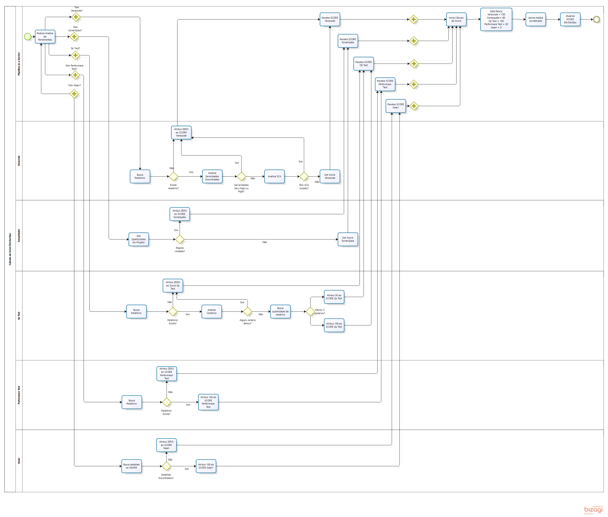

## Score DevSecOps

DevSecOps basicamente é a arte de acelerar processos de entregas para garantir o time-to-market dos times, com automações que criam interações entre times de desenvolvimentos e infraestrutura, esses são os famosos pipelines ou esteiras de entregas CI/CD \o/. 

Imagine que a cada commit que seu time de desenvolvedor irá realizar, varias ferramentas tem que se conversar e garantir a entrega do mesmo com uma nova funcionalidade em um ambiente inicialmente de desenvolvimento, depois homologação e assim com tudo pronto a tão sonhada PRODUÇÃO, a imagem abaixo ilustra essa jornada de entrega. Agora continue a imaginar: Implantei um processo de DevSecOps que a cada commit meu a funcionalidade chega em desenvolvimento/homologação/produção, porém como medir os pilares de qualidades das minhas entregas? Ou até mesmo ter um indicador para usar como DOD para evitar débitos técnicos? Essa é uma pergunta que todos se perguntam quando estão implantando DevSecOps, os livros só chegam até as ferramentas, mas nunca nessa parte. Mas nós tivemos um plano :)

Padronizamos o processo de criação de pipelines e chamamos o mesmo de PiaaS as a Service, como isso modularizamos cada ferramenta do processo de entrega de software (imagine como se fossem peças de LEGO), incluindo as ferramentas dos pilares de qualidade. Então como você cria um pipeline aqui? Simples, montando as peças de LEGO e criando seu caminho feliz para produção. E agora vem a mágica, cada peça de LEGO dos pilares de qualidade recebem uma nota quando as mesmas são usadas, medindo qualidade, segurança, performace, testes integrados, e cada uma com sua regra distinta para garantir o melhor aproveitamento das características da mesma, e com isso temos o DevSecOps Score.  Ter um DevSecOps Score te traz muitos benefícios que iremos falar logo abaixo, porém o maior de todos é a qualidade da sua entrega evitando débitos técnicos.  

## Pilares de Qualidade de Entrega

Acreditamos em um pilar de qualidade de entrega, pois existem coisas nesse momento se você errar pode ter muitos danos que vão da imagem da empresa, á doletas perdidas, são eles:

> <b>Arquitetura</b> - Errar neste item pode causar muito prejuízo em horas homem ou tecnologia adquirida de forma errônea;
<b>Segurança</b> - Aqui pode-se danificar sua imagem com os clientes, pois é o momento que vemos nos jornais de vazamento de dados;
<b>Qualidade de Entrega</b> - Este é bem amplo que vai desde como escrever uma linha de código que pode no futuro garantir uma melhor manutenibilidade de sustentação, ou performace ao usar o memso, ou até mesmo testes para garantir que seu cliente não seja o primeiro a reclamar;

E o <b>DevSecOps Score</b> é retirado desse pilar dos itens segurança e qualidade de entrega, mas calma já PiaaS as a Service o pode te ajudar a entender rápido a arquitetura escolhida e poder de forma rápida pivotar uma ideia ainda mesmo em POC, mas esse é um assunto para outro post (sorriso), aqui vamos falar só de Score. 

Como falamos temos peças de LEGO que você adiciona em sua receita de pipeline e a mesma por mágica te ajuda a entender os itens do pilar usando ferramentas corporativas totalmente integradas, são elas:

* Veracode - Medir a segurança do código estático da aplicação;
* Sonarqube - Medir a qualidade da escrita da aplicação junto com percentual testado da mesma;
* Performace - Medir o quanto sua aplicação é resistente a um bombardeamento de requisições, para saber se sua infra será apta ao volume desejado;
* Qualidade teste - Medir a simulação de uso do sistema com qualquer tipo de testes desejado;
* Gearr - Medir se as informações arquiteturais no cadastramento da solução então com bons indicadores;

E é claro se sua aplicação tem maturidade suficiente e já começou com uma cultura de qualidade de entrega acordada (peças de LEGO adicionadas em sua receita de pipeline), terá todos os indicadores lá no alto e o paraíso te espera.

## Entenda o cálculo

Chegamos ao ápice do POST (juro era necessário a alinhamento do entendimento até aqui (sorriso)).  Medimos a cada execução (commit) de sua aplicação no PiaaS as a Service se a mesma contempla os pilares de qualidade acordados pelos times guardiões das regras (GSO, Arquitetura de Soluções, DevSecOps PaaS, Change Management) e aplicamos uma média ponderada dos SCORE lidos para cada uma, com um peso acordado. Outro ponto importante é que aplicamos regras acima das ferramenta corporativas para garantir a batida perfeita, ou seja mesmo se sua aplicação recebe um SCORE da plataforma veracode, e encontramos algum problema lido a nota é ZERADA para sinalizar ao time algum problema a se resolver antes de levar a produção. Escrever todas as regras aqui pode ficar um pouco confuso, por isso criamos um fluxo que mostra claramente as regras e como o <b>DevSecOps Score</b> final é gerado, você pode ver na imagem abaixo:

Temos na imagem acima os pilares discutidos e regras para cada um antes do calculo final atribuído a aplicação, agora vamos falar nós benefícios de se ter um <b>DevSecOps Score</b> alto , essa é a melhor parte :). Formula resumida abaixo. 

## Benefícios de Pilares de Qualidade Elevados

Nem precisamos falar dos benefícios quando se trata de qualidade de entrega, são inúmeros, mas listamos aqui alguns bem legais:

* Aprovação automática de OM de produção - Isso mesmo quando sua aplicação tem um score acima de 80% a Ordem de Mudança da mesma será automaticamente aprovada por nosso Clovis (Mordomo de automação fictício), neste link falamos mais sobre;
* Team Score Elevado - Vamos falar logo mais sobre o Team Score, porém para deixar aqui como um dos grandes benefícios é não perder pontos no mesmo por um DevSecOps Score baixo;
* Evitar débitos técnicos - Eles são como juros rotativo do cartão de crédito que quando não pagos vão te cobrar a conta um dia, e deixar o DevSecOps Score elevado te garante um DOD da sua entrega, além de evitar problemas como performace, ou botões que não funcionam como deveriam, e muita segurança;
* Evitar que software de 6 meses sejam chamados de legados - O conceito de software legado deve ser dado aqueles que não recebem mais alterações em seus códigos por N razões, o que não podemos confundir é um software que não tem mais manutenibilidade por não se atentar aos débitos técnicos e pilares de qualidade, e nisso o DevSecOps Score te ajuda por garantir os DOD.

Por [aqui](https://pages.experian.local/download/attachments/776926149/calculo-score-devops.xlsx?version=1&modificationDate=1602017174161&api=v2) você tem acesso a uma planilha que preparamos para que você possa simular o DevSecops Score e entender melhor seu funcionamento :)

## Team Score

Team Score Serve para medir a maturidade das squads em alguns processos que precisam ser executados. Ele vai de 0 até 1000, sustentado no score pelos pilares. Os detalhes dos pilares pode ser consultado diretamente no material do time de Governança de TI [bem aqui](http://portalti/governancati/processosti/gestaoriscos/Documentos%20Compartilhados/Analytics/Team%20Score/Team%20Score%20-%20C%C3%A1lculos.pdf).

O Team Score Dashboard pode ser acessado por esse [link](http://portalti/governancati/processosti/gestaoriscos/Documentos%20Compartilhados/Analytics/Team%20Score/Team%20Score.twbx).

Integração do IT Team Score com DevSecOps Score
Motor de calculo considerado na integração:

1) Consideramos o DevSecOps Score do ultimo deploy PRODUTIVO do dia de cada aplicação;  * Observação se aplicação não tem deploy PRODUTIVO no dia não tem DevSecOps Score Considerado.
2) Calcula a média destes DevSecOps Score coletados dos últimos 30 dias, ou seja TODAY - 30 para obter toda a coleta a ser considerada;
3) Agregar as aplicações pelos grupos responsáveis (exemplo: cs-bi);
4) Realiza De_Para para normalizar os grupos responsáveis com as SQUAD's de desenvolvimento (exemplo: está no time Tribe BI da Diretoria New Bureau & Agility);

5) Após a normalização é calculada a média dos score para as Tribes/Times a partir dos grupos normalizados;

6) Com o DevSecOps Score devidamente calculado a  tabela de referencia é aplicada para obter a parcela IT Team Score da Tribe/Time;

Tabela de referencia para conversão do DevSecOps Score para o IT Team Score:

| DevSecOps Score                                                                     | % de Perda IT Team Score |
|-------------------------------------------------------------------------------------|--------------------------|
| 0 - 10 pontos                                                                       | 100%                     |
| 11 - 20 pontos                                                                      | 89%                      |
| 21 - 30 pontos                                                                      | 78%                      |
| 31 - 40 pontos                                                                      | 67%                      |
| 41 - 50 pontos                                                                      | 56%                      |
| 51 - 60 pontos                                                                      | 45%                      |
| 61 - 70 pontos                                                                      | 34%                      |
| 71 - 80 pontos                                                                      | 23%                      |
| > 80 pontos                                                                         | 0%                       |

`Observação:  Quando a aplicação passa várias vezes na esteira de DevSecOps durante o mesmo dia, consideramos o score da última passagem da aplicação na esteira naquele dia. (ambiente PRODUTIVO)`

## FAQ

P: Quando o DevSecOps Score  é atualizado?
R: Temos um processo de ETL que rodamos de hora/hora e atualiza nossa base de DevSecOps Score, algumas vezes sua aplicação não pode ir na próxima hora pois ele aguarda a liberação do novo scan do veracode para recalcular o novo DevSecOps Score antes do envio.

P: Como o DevSecOps Score é calculado quando minha aplicação está fazendo deploy em Produção (Master) ? Sendo que não tenho testes nesse momento.
R: Sim, você está certo em não ter no momento de Pipeline testes pois precisa garantir a menor indisponibilidade ao cliente, sendo assim para produção você tem somente o deploy. Porém não fazemos o calculo nesse momento e sim lemos da OM aberta para aquela implantação a partir do campo test-result da mesma gerado da homologação. Então o DevSecOps Score é calculado em processo de desenvolvimento para garantir o feedback para os times, e em homologação para garantir a abertura da OM com os indicadores lidos no processo. 

P: Onde acompanho meu DevSecOps Score?
R: Nosso processo de ETL envia para um banco de dados onde expomos as informações de todas execuções em nosso [DevSecOps BI](http://spobrmetabasebi:3000/public/dashboard/fce3e9be-0e3d-4e0f-a19a-4f13948b63af), porém o time de desenvolvimento acompanha todos os cálculos em seus pipelines de entrega e via Teams. 