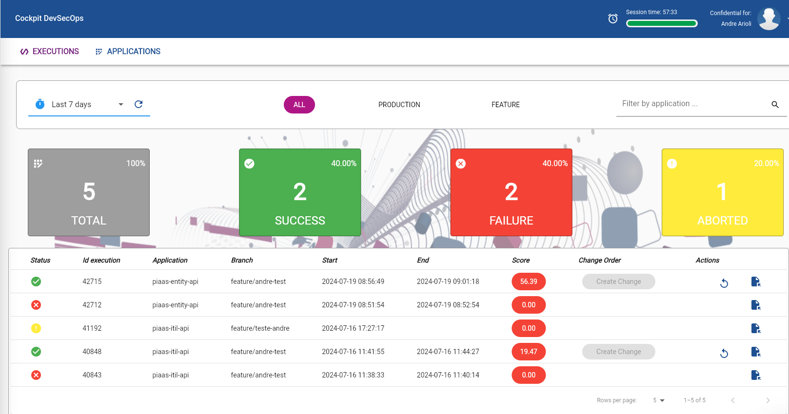
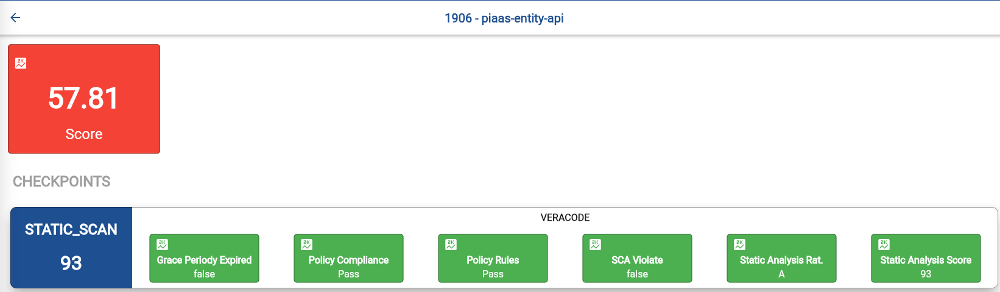

# Veracode

O Veracode pode ser executado de forma automática pelas aplicações que utilizam o PiaaS. Dessa forma você garante o cumprimento das políticas de segurança da companhia em suas aplicações, mantendo um ambiente mais seguro para toda a empresa!

Você pode conferir [aqui](pipelines.md) como realizar a invocação do Veracode em sua aplicação em seu piaas.yml.

Mas atenção: é necessário ter o cadastro da sua aplicação no Veracode previamente. Consulte seu SRE ou o time de GSO diretamente para mais detalhes.

### Entendendo o fluxo de scan

Ao executar sua aplicação através do PiaaS com a invocação do Veracode configurado, nossos motores irão iniciar imediatamente o processamento para submeter uma nova análise para o Veracode.
A única exceção é quando a versão da sua aplicação já possuí um relatório válido nos últimos 2 dias, nesse caso, será considerado este relatório e um novo não será submetido.

Caso queira forçar a emissão de uma nova análise, desconsiderando o relatório emitido dentro dos 2 dias, confira como na documentação referenciada inicialmente.

Quando o processamento estiver finalizado você conseguirá conferir diretamente no PiaaS o resultado dessa análise e o Score atribuído para esse pilar.

### Visualizando o resultado do scan

Ao acessar o PiaaS, na guia de <b>Executions</b>, você pode visualizar todas as execuções realizadas por você em nosso pipeline. Note que também é possível visualizar o Score geral das execuções. Para conferir maiores informações sobre o Score você pode clicar diretamente nesse botão.

Nessa página você terá acesso a todos os Scores gerados nessa execução, bem como seus respectivos detalhes (quando disponível). Para o Veracode, você terá a visão das informações referente a seu scan, Score atribuído, bem como eventuais violações de políticas estabelecidades pelo time de GSO.

Em breve também disponibilizaremos a possibilidade de baixar o relatório completo através desse menu. Enquanto isso não acontece, você pode acessar o relatório diretamente na console do Veracode, através do Okta.