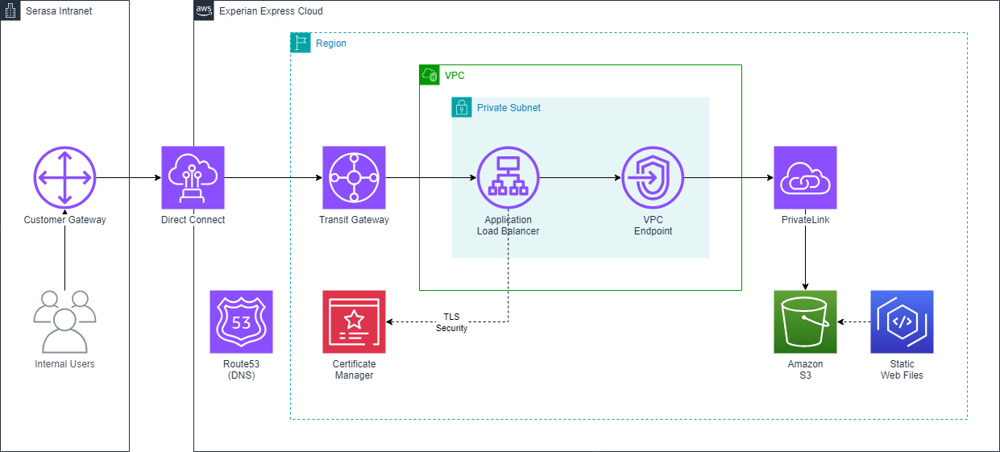

# aws-internal-frontend
----

## O que é o aws-internal-frontend?

Olá, sou uma automação para publicação de aplicações web estáticas na **intranet**.

Para mais informações acesse a documentação oficial no [DevHub Portal](https://devhub.experian.local/catalog/default/component/serasa-handbook/docs/techdocs/arq_solutions/blueprints/frontend/internal/index_front_end_internal/).

| Caracteristica         | Descrição             
| ---------------------- | ------------------------
| Categoria              | AWS
| ITIL Request           | ❌️
| ITIL Change Order      | ❌️
| Inner Source           | Times podem participar da evolução do mesmo
| Conformidade           | Esta automação garante os padrões de Arquitetura para publicação de aplicações web.

## Como lançar esta automação?
* [User Guide](https://code.experian.local/projects/SCIB/repos/joaquin-x/browse/doc/user_guide.md) - Escolha `aws-internal-frontend`.

## Como contribuir com esta automação?
* [Contributing Guide](docs/CONTRIBUTING.md) - Inner Source.

## Versionamento

Não deixe de saber e contribuir para as próximas versões do `aws-internal-frontend` [Backlog](docs/BACKLOG.md) 

`1.0.0` - Wed Jun 26 15:15:35 -03 2024
* `ADD` -  Criação do repositório e sua estrutura inicial  

## Autores

* **DeX and Engineering** - (architecturebr@br.experian.com)